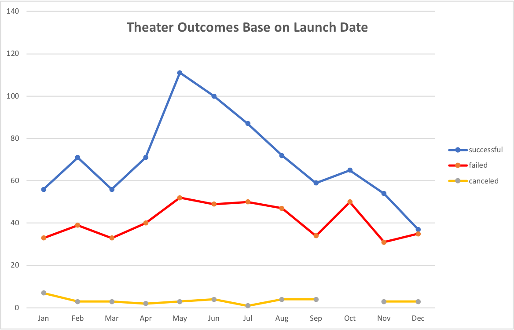
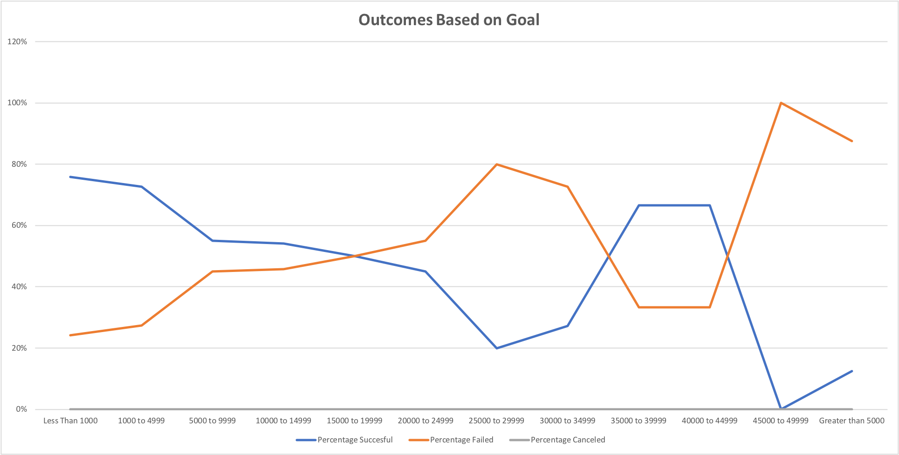

# Kickstarted Challege Analysis

## Overview of Project

### Project Background
Louise wanted to start a Crowdfunding campaing to help fund her play called Fever and had en estimated budget of $10,000. I was given the task to help her analyze Crowdfunding data from previous campaigns to determine if there were specific factors that make projects campaign successful and provide her insights so she could plan her own campaign and be successful.
### Previous Work and Results
During the initial work, I was able to use excel to analyze campaigns data and provide Louise a better understanding of similar campaigns from start to finish so she could leverage and apply learnings from those campaigns. Louise's play Fever came close to its fundraising goal in a short amount of time. Now, she wants to know how different campaigns fared with respect to their launch date and their funding goals.
### Purpose of Analysis
The objective of the analysis is to understand how different campaigns within Louise's category performed with respect to their launch date and their funding goals and provide Louise additional information so she could improve the outcome of her fundraising campaign.

---
## Analysis and Challenges
In order to complete the task, two separate analysis of the data was performed based on launch date and funding goals using the Kickstarted data sheet 

Link to spreadsheet
[Kickstarter_Challenge.xlsx.zip](Challenge/Kickstarter_Challenge.xlsx.zip)

### Analysis of Outcomes Based on Launch Date
To understand how campaigns performed based on launch date, I created a line plot to visualize the campaigns outcome (successful, failed and canceled) vs their launch date.
To come up with the data used for plotting, the following workflow was used:
* Created a column in the kickstarted sheet displaying the year of the launch date
* Created a pivot table using the outcome data in columns, launch date in rows and campaigns outcomes count to populate the table
* The rows group selected was month to show monthly data
* The pivot table was filtered by Theater which is Louise's campaign category
* Inserted a line plot to display the Theater Outcomes Based On Launch Date

Theater Outcomes vs Launch Date Plot

### Analysis of Outcomes Based on Goals
To understand how campaigns performed based on funding goals, I created a line plot to visualize the campaigns outcome (successful, failed and canceled) vs funding goals.
To come up with the data used for plotting, the following workflow was used:
* Created a table to display the campaigns outcome count based on funding goals ranges
  * Goal ranges were set in increments of $5,000 from less than 1000 to greater than $50,000.
  * Used COUNTIFS function to populate the number of successful, failed and canceled campaigns based on goal ranges and the “play” subcategory to align with Louise’s campaign.
* Calculated total projects and estimated the percentage of the campaigns outcome based on the total projects for each range
* Inserted a line plot to display the Outcomes Based on Goals

Theater Outcomes vs Goals Plot

### Challenges
The time to populate the number of successful, failed and canceled campaigns in the Outcome Based on Goals analysis was more than I expected due to the lack of experience using the COUNTIFS function.

---
## Results

### Conclusions of the Outcomes Based On Launch Date
* The month that launched the most successful campaigns was in May with 111 followed by June with 100 campaigns.
* The months of Jan, Feb, March, Sep, Oct and Nov have very similar successful campaigns with Dec being the lowest with successful campaigns

### Conclusions of the Outcomes Based on Goals
* The highest percentage of successful campaigns are the ones with funding goals less than $4,999 with more or equal to 73% success campaigns
* Campaigns with goals less than $14,999 have more success than fails

### Limitations of this Data Set
One limitation with the data set is that the conclusions of the outcomes based on launch date are mostly driven by campaigns with launch year in 2015 and 2016 there are not enough campaigns in the rest of the years. It would be good to understand what is the factor influencing campaigns with launch years 2015 and 2016

### Other Additional Tables or Graphs that could be Created
Another graph that can be created is a bar chart to show the outcomes against the goal ranges which will clearly show that the most successful campaigns are the ones with funding goals between $1,000 and $4,999 and less than $1,000

---

